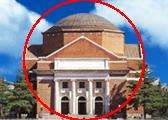
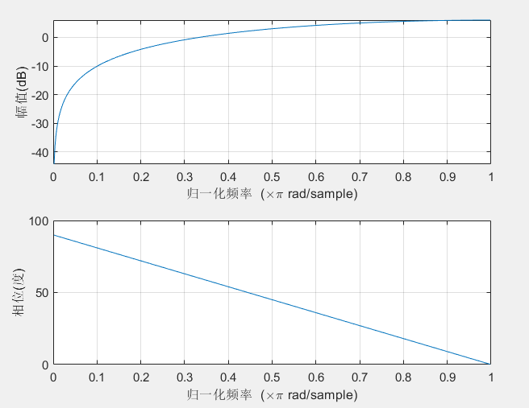
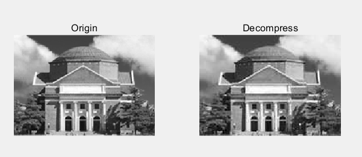
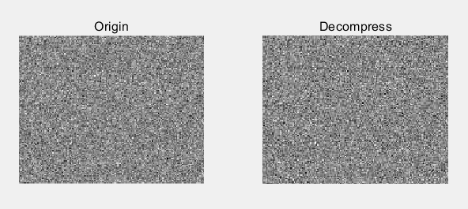
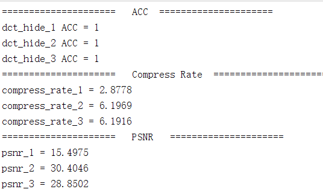
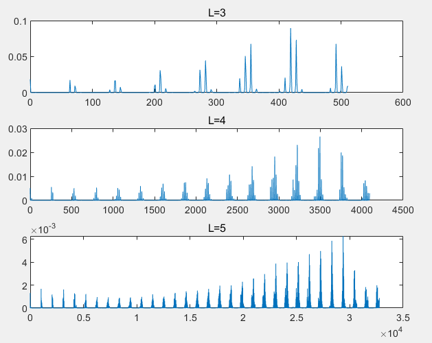
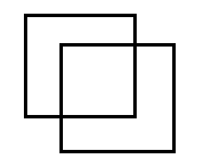
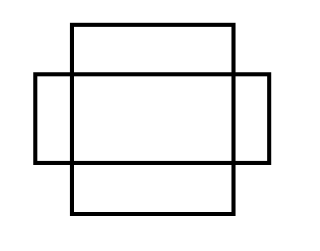
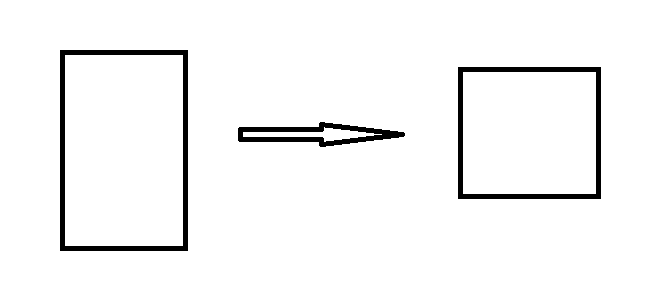
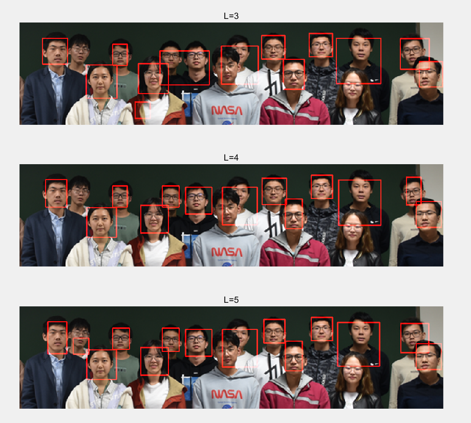

# MATLAB 图像处理

## 作业要求

参见`docs/图像处理大作业.pdf`

## 图像处理思路

### 3.1 图像基础知识

#### （1）在图像中画圆

首先确定圆的圆心，为测试图像的中心；然后确定圆的半径，为图像长、宽中的较小值。接下来根据圆的定义画圆：所有与圆心的距离等于半径的点构成一个圆。在这里，为了让画出的圆清晰可见，将所有与圆心距离在 0.98~1.02 倍半径之间的点全部标红，呈现在图像上。取出标红点的关键代码如下：

~~~matlab
size_pic = size(hall_gray);
idx = zeros([size_pic, 2]);
for i = 1: 1: height
    for j = 1: 1: width
        idx(i, j, 1) = i;
        idx(i, j, 2) = j;
    end
end
circle_idx = ((idx(:, :, 1) - (height + 1) / 2) .^ 2 + (idx(:, :, 2) - (width + 1) / 2) .^ 2 <= (1.02 * radius) ^ 2 & ...
              (idx(:, :, 1) - (height + 1) / 2) .^ 2 + (idx(:, :, 2) - (width + 1) / 2) .^ 2 >= (0.98 * radius) ^ 2);
~~~

最后效果如下：

#### （2）将测试图像涂成国际象棋状的“黑白格”

将测试图像分成 8*8 的区域，然后对每块区域根据国际象棋“黑白格”的规则染色。在黑色的地方，将原图对应区域置为0；白色的地方则保持不变。结果如下

本题代码位于`src/hw1_3_2.m`中。

### 3.2 图像压缩编码

#### （1）在变换域预处理

图像的预处理是将每个像素灰度值减128，若要在变换域进行，可以利用DCT变换的线性性来操作。

首先对原图像作二维DCT变换，然后对相同大小的、所有元素均为128的矩阵作二维DCT变换。由于全128的矩阵DCT变换结果只有直流分量，即左上角元素，所以只需让原图的DCT变换结果的直流分量减去全128矩阵DCT变换结果的直流分量即可。具体代码如下：

~~~matlab
[part_h, part_w] = size(hall_part);
DC_128 = dct2(zeros(part_h, part_w) + 128);
maphall_2 = dct2(hall_part);
maphall_2(1, 1) = maphall_2(1, 1) - DC_128(1, 1);
~~~

这样操作后，与先预处理再DCT变换的结果相比，计算MSE，为 7.1000e-28，非常小，说明两种算法计算结果相同。

本题代码位于`src/hw2_4_1.m`中。

#### （2）实现二维DCT变换

二维DCT变换，首先是找到DCT算子**D**。我直接根据指导书的公式（2.5），在`matlab`中实现算子**D**。关键代码如下：

~~~matlab
function D_mat = DCT2_D(input_dim)
    row = linspace(0, input_dim - 1, input_dim)';
    col = linspace(1, input_dim * 2 - 1, input_dim);
    cos_mat = cos(row * col * pi / (2 * input_dim));
    cos_mat(1, :) = cos_mat(1, :) / sqrt(2);
    D_mat = sqrt(2 / input_dim) * cos_mat;
end
~~~

得到DCT算子**D**后，就可以根据输入图像的维度，计算二维DCT变换。假设灰度图像维度为 [height, width]，则其二维DCT变换结果可以用以下代码来求得

~~~matlab
[height, width] = size(input_mat);
dct_coef = DCT2_D(height) * double(input_mat) * DCT2_D(width)';
~~~

我将我实现的DCT变换函数，与`matlab`提供的`dct2`进行比较，计算MSE，为9.9944e-26。MSE非常小，可以认为两种方法计算结果相同。

本题代码位于`src/hw2_4_2.m`中，计算DCT算子的函数封装在`src/DCT2_D.m`中，计算二维DCT变换的函数封装在`src/DCT2.m`中。

#### （3）部分DCT系数置零

将原图按 8*8 分块后，对每块作二维DCT变换，再将DCT系数矩阵右侧四列、左侧四列系数矩阵分别置零，再作逆DCT变换看结果。

理论上分析，DCT系数矩阵左上角元素代表低频分量，右下方系数表示横竖两个方向中迅速变换的高频分量。由于常见的图片通常颜色、亮度都是缓慢变换的，因此DCT系数矩阵越往左上方取值越大，越向右下方取值越小。由于低频分量值大，对图像影响大，高频分量值小，对图像影响小，所以，理论分析DCT系数矩阵右侧四列元素置零对图像影响较小，左侧四列元素置零则会对图像有很大影响。实际结果也正是如此，结果如下：

本题代码位于`src/hw2_4_3.m`中。

#### （4）DCT系数转置、逆时针旋转90°、旋转180°

若DCT系数矩阵**C**转置，考虑DCT变换的公式
$$
C=dct(P)=DPD^T\\
P=idct(C)=D^TCD\\
D^{-1}=D^T
$$
所以**C**转置后再逆变换，结果为
$$
D^TC^TD=(D^TCD)^T=P^T
$$
结果为原图的转置。

由于右上方的系数反映图像中横向变化的纹理强度，逆时针旋转90°后，原本右下方高频分量的元素来到了右上方。由于高频分量元素本身就较小，所以DCT系数矩阵逆时针旋转90°后再逆变换，得到的图像横向几乎不会变化，呈现很强的横向纹理。

若将DCT系数矩阵旋转180°，左上方低频分量将会和右下方高频分量换位，导致恢复的图像低频分量小，高频分量大，从而图像变化剧烈，呈现格子状的纹理。

实际运行时，结果与理论分析相近，如下

本题代码位于`src/hw2_4_4.m`中。

#### （5）系统特性

如果认为差分编码是一个系统，则这个系统方程为
$$
y(n)=x(n-1)-x(n)
$$
使用`freqz`函数查看该系统频率响应如下

由此可以看出，该系统可看作为高通滤波器。DC系数先进行差分编码再进行熵编码，说明DC系数含有较多的高频分量。

本题代码位于`src/hw2_4_5.m`中。

#### （6）DC预测误差与Category

记DC预测误差为`delta`，Category为`C`，则它们之间的关系为
$$
C=ceil(log2(abs(delta)+1))
$$
由此可以推出，Category表示了DC预测误差的二进制表示位数。

#### （7）设计实现Zig-Zag扫描

由于本次作业中，只需对 8*8 的矩阵进行 Zig-Zag 扫描，因此可以直接将各索引手动编排好，然后直接用 matlab 的数组索引功能完成扫描。扫描代码如下

~~~matlab
function output = zig_zag(input)
    temp = reshape(input, [64, 1]);
    output = (temp([
        1, 9, 2, 3, 10, 17, 25, 18, ...
        11, 4, 5, 12, 19, 26, 33, 41, ...
        34, 27, 20, 13,  6,  7, 14, 21, ...
        28, 35, 42, 49, 57, 50, 43, 36, ...
        29, 22, 15,  8, 16, 23, 30, 37, ...
        44, 51, 58, 59, 52, 45, 38, 31, ...
        24, 32, 39, 46, 53, 60, 61, 54, ...
        47, 40, 48, 55, 62, 63, 56, 64 ...
    ]));
end
~~~

首先，我先将输入的 `8*8` 的矩阵变为 `64*1` 的大小。然后，我根据 Zig-Zag 的规则，事先将理论的 Zig-Zag 扫描结果的各位置索引记好。最后，即可直接通过数组索引的方式完成扫描。 

为了验证我这一算法是正确的，我设计了如下测试样例进行检验

~~~matlab
test_input = [
     [1,  2,  6,  7, 15, 16, 28, 29]; ...
     [3,  5,  8, 14, 17, 27, 30, 43]; ...
     [4,  9, 13, 18, 26, 31, 42, 44]; ...
     [10, 12, 19, 25, 32, 41, 45, 54]; ...
     [11, 20, 24, 33, 40, 46, 53, 55]; ...
     [21, 23, 34, 39, 47, 52, 56, 61]; ...
     [22, 35, 38, 48, 51, 57, 60, 62]; ...
     [36, 37, 49, 50, 58, 59, 63, 64] ...
];
~~~

这一矩阵经过 Zig-Zag 扫描后，理论上应该输出 1~64 的序列，使用我设计的算法扫描得到结果正是如此，说明算法实现无误。

本题代码位于`src/hw2_4_7.m`中。

#### （8）对测试图像分块、DCT与量化

首先是预处理，灰度图各像素减去128；然后是将图像每个 8*8 的块进行DCT变换并点除量化矩阵；最后是将结果依次排列。

前两步的代码如下

~~~matlab
hall_pre = double(hall_gray) - 128;
hall_quan = blockproc(hall_pre, [8, 8], @(mat)(zig_zag(round(dct2(mat.data) ./ QTAB))));
~~~

重新排列时，我按照从左至右、从上至下的方式来遍历，代码如下

~~~matlab
[height, width] = size(hall_quan);
res = zeros([64, height * width / 64]);
for i = 0: 1: height / 64 - 1
    for j = 1: 1: width
        res(:, i * width + j) = hall_quan(i * 64 + 1: (i + 1) * 64, j);
    end
end
~~~

本题代码位于`src/hw2_4_8.m`中。

#### （9）实现 JPEG 编码

关键点在于计算DC系数的码流和AC系数的码流。

首先是DC系数码流。DC系数就是第8问中量化矩阵的第一行，码流的计算需要先通过差分编码再进行熵编码。

熵编码时，可以利用DC预测误差与Category的关系：Category表示了DC预测误差的二进制表示位数，并利用给好的Huffman编码表DCTAB进行编码。对于每个预测误差，首先根据其Category确定对应的Huffman编码，然后将其幅度用二进制表示，接在其Huffman编码后。若幅度为0，无需编码幅度，Huffman编码已经包含了该信息。对于负数，幅度采用1补码，此时最高位为0。这样的方式表示每个预测误差，可以准确无误并容易解码。代码如下，其中`quan_mat`为量化矩阵：

~~~matlab
dc_cof = quan_mat(1, :)';
dc_diff = [dc_cof(1); dc_cof(1: end - 1) - dc_cof(2: end)];
dc_category = min(ceil(log2(abs(dc_diff) + 1)), 11);
dc_code = [];
for i = 1: 1: length(dc_diff)
	cat_temp = DCTAB(dc_category(i) + 1, 2: DCTAB(dc_category(i) + 1, 1) + 1)';
	if dc_diff(i) ~= 0
		mag_temp = dec2bin(abs(dc_diff(i)))' - '0';
		if dc_diff(i) < 0
			mag_temp = ~mag_temp;
		end
	else
		mag_temp = [];
	end
	dc_code = [dc_code; cat_temp; mag_temp];
end
~~~

AC系数编码与DC系数稍有不同。AC系数是量化矩阵第2行及之后的元素，需要根据每一个非零系数值及其行程进行编码。AC系数中可能有较多的0，因此利用行程编码能较好地提高压缩率。我们通过提供的ACTAB，以非零数值与行程为索引，找到对应的Huffman编码，然后再在其后接上非零数值的二进制表示（负数为1补码），从而完成对AC系数的编码。

这其中用到两个符号：

- ZRL：[1, 1, 1, 1, 1, 1, 1, 1, 0, 0, 1]，表示连续 16 个 0
- EOB：[1, 0, 1, 0]，表示每个块中编码完最后一个非零系数

我采用这样的方式进行编码：对每个块（也就是 63*1 的列），遍历时实时记录经过的零个数，当到第一个非零数值时，对记录的零个数求除 16 的商与余数，商为需要加上的 ZRL 的个数，余数为用于提供Huffman编码的索引，即行程。若一直到每个块最后，都没找到非零数值，则码流中添加 EOB 。

求解AC码流的代码如下

~~~matlab
ac_cof = quan_mat(2: end, :);
ac_size = min(ceil(log2(abs(ac_cof) + 1)), 10);
ZRL = [1, 1, 1, 1, 1, 1, 1, 1, 0, 0, 1]';
EOB = [1, 0, 1, 0]';
[ac_h, ac_w] = size(ac_size);
ac_code = [];
for i = 1: 1: ac_w
    run = 0;
    for j = 1: 1: ac_h
        if ac_size(j, i) == 0
            run = run + 1;
        else
            run_epoch = floor(run / 16);
            run_mod = mod(run, 16);
            run = 0;
            while run_epoch > 0
                ac_code = [ac_code; ZRL];
                run_epoch = run_epoch - 1;
            end
            size_temp = ACTAB(run_mod * 10 + ac_size(j, i), 4: ACTAB(run_mod * 10 + ac_size(j, i), 3) + 3)';
            amp_temp = dec2bin(abs(ac_cof(j, i)))' - '0';
            if ac_cof(j, i) < 0
                amp_temp = ~amp_temp;
            end
            ac_code = [ac_code; size_temp; amp_temp];
        end
    end
    ac_code = [ac_code; EOB];
end	
~~~

至此，就完成了DC码流与AC码流的计算。

本题代码位于`src/hw2_4_9.m`中，编码函数封装在函数文件`src/Compress.m`中。

#### （10）计算压缩比

计算时需统一单位，我这里用 bit 计算。原图 1 像素为 0~255，用 8bits 储存，因此压缩比计算公式为

~~~matlab
compress_rate = img_height * img_width * 8 / (length(dc_code) + length(ac_code));
~~~

计算结果为：6.4247

本题代码位于`src/hw2_4_10.m`中。

#### （11）JPEG 解码

解码需分别对DC码流与AC码流解码。

由于Huffman编码为前缀编码，任何码字都不是其他码字的前缀，因此解码起来比较简单。对于一段码字，只要在Huffman编码表中匹配上了，那由于前缀码的特性，这段码字就是一段Huffman码。

因此，对DC码流进行解码时，逐段码流和Huffman编码表DCTAB进行比对，一旦比对上了，就反推这段码流对应的Category，然后接下来的长为Category的码流，代表的就是幅度。如果首位是1，则是正幅度；首位是0，则是负幅度；Category若为0，则幅度就为0。对整个DC码流进行如上遍历操作，很容易就将DC码流解码完成。解码完成后，得到的是差分编码后的结果，然后还要将差分编码再解码，得到原始的DC系数。代码如下

~~~matlab
dc_diff = zeros([img_height * img_width / 64, 1]);
last_idx = 1;
cnt = 1;
i = 1;
while i <= length(dc_code)
    for j = 1: 1: size(DCTAB, 1)
        if isequal(dc_code(last_idx: i)', DCTAB(j, 2: DCTAB(j, 1) + 1))
            if j - 1 ~= 0
                mag_temp = dc_code(i + 1: i + j - 1)';
                if mag_temp(1) == 1
                    dc_diff(cnt) = bin2dec(char(mag_temp + '0'));
                else
                    dc_diff(cnt) = -bin2dec(char(~mag_temp + '0'));
                end
            end
            last_idx = i + j;
            i = i + j;
            cnt = cnt + 1;
            break;
        end
    end
    i = i + 1;
end
dc_cof = zeros(size(dc_diff));
dc_cof(1) = dc_diff(1);
for i = 2: 1: size(dc_cof, 1)
    dc_cof(i) = dc_cof(i - 1) - dc_diff(i);
end
~~~

AC码流解码过程类似，不过得注意两个特殊符号：ZRL 和 EOB。AC码流解码过程中，不仅要在Huffman编码表中去比对，也要与 ZRL 和 EOB 去比对，其余步骤和DC码流解码思路一样。代码如下

~~~matlab
ac_cof = zeros([63, img_height * img_width / 64]);
i = 1;
last_idx = 1;
row_cnt = 1;
col_cnt = 1;
while i <= length(ac_code)
    if isequal(ac_code(last_idx: i), EOB)
        col_cnt = col_cnt + 1;
        row_cnt = 1;
        last_idx = i + 1;
        i = last_idx;
    elseif isequal(ac_code(last_idx: i), ZRL)
        row_cnt = row_cnt + 16;
        last_idx = i + 1;
        i = last_idx;
    else
        for j = 1: 1: size(ACTAB, 1)
            if isequal(ac_code(last_idx: i)', ACTAB(j, 4: ACTAB(j, 3) + 3))
                row_cnt = row_cnt + ACTAB(j, 1);
                amp_temp = ac_code(i + 1: i + ACTAB(j, 2))';
                if amp_temp(1) == 1
                    ac_cof(row_cnt, col_cnt) = bin2dec(char(amp_temp + '0'));
                else
                    ac_cof(row_cnt, col_cnt) = -bin2dec(char(~amp_temp + '0'));
                end
                row_cnt = row_cnt + 1;
                last_idx = i + ACTAB(j, 2) + 1;
                i = last_idx;
                break;
            end
        end
    end
    i = i + 1;
end
~~~

得到解码后DC码流和AC码流后，两者合并得到量化矩阵，再经过第8问的逆过程与逆DCT变换，即可解码出原图。代码如下

~~~matlab
whole_cof = [dc_cof'; ac_cof];
hall_quan = zeros([img_height * 8, img_width / 8]);
for i = 0: 1: img_height / 8 - 1
	hall_quan(i * 64 + 1: (i + 1) * 64, :) = whole_cof(:, i * img_width / 8 + 1: (i + 1) * img_width / 8);
end
img = uint8(blockproc(hall_quan, [64, 1], @(mat)(idct2(inv_zig_zag(mat.data) .* QTAB))) + 128);
~~~

接下来是评价编解码效果。

客观方法计算PSNR，PSNR计算公式为
$$
PSNR=10lg(\frac{255^2}{MSE})
$$
实际计算结果为：31.1874，是一个比较高的结果，因此说明图像失真较小。

主观上，原图与编解码后的图片如下

二者差别不大，只在一些细微处有少许差别，说明压缩后图像失真较小。

本题代码位于`src/hw2_4_11.m`中，解码代码封装在函数文件`src/Decompress.m`中。

#### （12）量化步长减半

要让量化步长减半，只需让提供的QTAB除以2即可。

量化步长减半后，PSNR从31.1874变为34.2067，图像失真程度减少；但压缩比从6.4247降低到4.4097，压缩程度减少。这说明，要保持高的压缩比，就要牺牲图像的还原度。

本题代码位于`src/hw2_4_12.m`中。

#### （13）对雪花图像编码

对雪花图像编解码，原图与解码图像如下

压缩比为 3.645，PSNR 为 22.9244。

可以看到，PSNR不算大，压缩比也较小。原因是，雪花图像并不美丽，像是随机生成的噪音，高频分量大，导致量化后 Category 可能偏大，导致 Huffman 编码较长，压缩比较小。同时由于高频分量经过量化后，失真较大，因此 PSNR 较小。

本题代码位于`src/hw2_4_13.m`中。

### 3.3 信息隐藏

#### （1）空域隐藏和提取

空域信息隐藏，是将信息表示成二进制码流，再二进制码流的每位信息替换图像中各像素亮度分量的最低位。这一操作使用 matlab 提供的 `bitset`函数即可实现。代码如下

~~~matlab
rand_info = logical(randi([0, 1], height, width));
hall_hide = bitset(hall_gray, 1, rand_info);
~~~

经过编解码后，要再提取出隐藏的信息时，使用 matlab 提供的`bitand`方法，即可实现信息提取。

~~~matlab
[dc_code, ac_code, img_height, img_width] = Compress(hall_hide, DCTAB, ACTAB, QTAB);
hall_decompress = Decompress(dc_code, ac_code, img_height, img_width, DCTAB, ACTAB, QTAB);
decode_info = bitand(hall_decompress, uint8(ones([height, width])));
~~~

经过提取后，与原本隐藏的信息进行对比，准确率大约在 50% 左右，和随机蒙的差不多，说明其抗 JPEG 编码能力极差。

本题代码位于`src/hw3_4_1.m`中

#### （2）变换域信息隐藏

方法一：信息位替换量化后DCT系数的最低位。关键代码如下

~~~matlab
hall_pre = double(img) - 128;
hall_quan = blockproc(hall_pre, [8, 8], @(mat)(zig_zag(round(dct2(mat.data) ./ QTAB))));
[height, width] = size(hall_quan);

quan_mat = zeros([64, height * width / 64]);
for i = 0: 1: height / 64 - 1
    for j = 1: 1: width
        quan_mat(:, i * width + j) = hall_quan(i * 64 + 1: (i + 1) * 64, j);
    end
end
quan_mat = double(bitset(int32(quan_mat), 1, info));
~~~

方法二：信息位替换若干量化后DCT系数。我这里选用量化系数中，较小值的位置去替换量化后DCT系数，这样对原图的影响较小。

确定替换位置的方法如下

~~~matlab
threshold = 12;
less_thre = QTAB <= threshold;
less_thre_idx = find(less_thre);
~~~

然后根据选取的位置，用信息位去替换

~~~matlab
hall_pre = double(img) - 128;
hall_quan = blockproc(hall_pre, [8, 8], @(mat)(zig_zag(round(dct2(mat.data) ./ QTAB))));
[height, width] = size(hall_quan);

quan_mat = zeros([64, height * width / 64]);
for i = 0: 1: height / 64 - 1
    for j = 1: 1: width
        quan_mat(:, i * width + j) = hall_quan(i * 64 + 1: (i + 1) * 64, j);
    end
end
last_bit = bitand(int32(quan_mat), int32(ones(size(quan_mat))));
for i = 1: 1: size(last_bit, 2)
    last_bit(hide_idx, i) = info(:, i);
end
quan_mat = double(bitset(int32(quan_mat), 1, last_bit));
~~~

方法三：隐藏信息用1，-1序列表示，再逐一将信息位追加在每个块 Zig-Zag 顺序的最后一个非零系数后；若原本该最后一个系数不为0，那就用信息位替换该系数。关键代码如下

~~~matlab
hall_pre = double(img) - 128;
hall_quan = blockproc(hall_pre, [8, 8], @(mat)(zig_zag(round(dct2(mat.data) ./ QTAB))));
[height, width] = size(hall_quan);

quan_mat = zeros([64, height * width / 64]);
for i = 0: 1: height / 64 - 1
    for j = 1: 1: width
        col_temp = i * width + j;
        quan_mat(:, col_temp) = hall_quan(i * 64 + 1: (i + 1) * 64, j);
        for k = 64: -1 : 1
            if quan_mat(k, col_temp) ~= 0
                if k == 64
                    quan_mat(64, col_temp) = info(col_temp);
                else
                    quan_mat(k + 1, col_temp) = info(col_temp);
                end
                break;
            end
        end
    end
end
~~~

三种方法实现起来都比较简单，其信息隐藏部分分别封装在函数文件`dct_conceal_1.m`、`dct_conceal_2.m`、`dct_conceal_3.m`中，将信息隐藏后的系数逆变换为图片的代码，分别封装在函数文件`dct_reveal_1.m`、`dct_reveal_2.m`、`dct_reveal_3.m`中。

三种方法隐藏随机信息后，客观上的对比如下

可以看到，ACC都是1，压缩率第一种方法最小。总体来看，第二种和第三种方法效果差不多。

三种方法隐藏随机信息后，呈现的图片结果如下

主观上从图片上看，用第一种方法隐藏信息的结果较差，第二、第三种方法效果差不多。理论上分析，由于直接在量化后的矩阵加信息位，如果量化系数较大，则最后一位改为信息位后，对原图的影响较大。而第二种方法则是考虑了这一影响，选择了QTAB中元素较小的位置进行信息隐藏，这样就对原图的影响较小。第三种方法也是类似的思路，由于1与-1的变化对整个系数矩阵影响较小，所以信息隐藏后对原图也不会有太大影响。

本题代码位于`src/hw3_4_2.m`中。

### 3.4 人脸检测

#### （1）训练人脸标准

如果样本人脸大小不一，图像不需要首先调整为相同大小，只需对每个像素的颜色遍历即可。

训练人脸标准时，需要将RGB颜色对应到颜色数n，代码为

~~~matlab
r = floor(face_temp(j, k, 1) * 2^(L - 8));
g = floor(face_temp(j, k, 2) * 2^(L - 8));
b = floor(face_temp(j, k, 3) * 2^(L - 8));
n = r * 2^(2 * L) + g * 2^L + b;
~~~

然后根据颜色索引 n，统计各个颜色出现的频率，然后再对该频率向量归一化，得到一张图片的人脸标准。

对每张训练集图片都计算相应的人脸标准向量，然后取平均，得到训练好的人脸标准向量。

对于 L 为 3，4，5 的情况，将对应的人脸标准绘成图，如下

可以看到，不同的 L 值，人脸特征的趋势是一致的。L 值越大，颜色区分能力越强，分辨率越高。对于较小的 L 值，会使大范围内相近的颜色不能被区分开。同时，对于较高的 L 值，相近的颜色范围内求和就会得到较低的 L 值的图像。

本题代码位于`src/hw4_3_1.m`中。

#### （2）实现人脸检测算法

首先，我们使用人脸图像训练集训练人脸特征向量，然后使用该特征向量进行进一步人脸检测。

我设计的人脸检测算法，先用小矩形在图像上移动，逐个计算小矩形内的颜色特征向量，然后与训练的人脸特征向量计算距离，距离公式为
$$
d(u,v)=1-\Sigma_n\sqrt{(u_n,v_n)}
$$
将所有与人脸特征向量距离小于阈值的小矩形，全部存储下来。由于小矩形移动时，会有一定的重叠。下一步就是将所有重叠的矩形，整合成一个大矩形。这里使用的是暴力遍历，对每个储存下来的小矩形，与其他所有矩形进行比较，将所有可以合成的小矩形一并合成，计算复杂度为 O(n^2) 。代码如下

~~~matlab
for i = 1: 1: length(x_less)
    if x_less(i) ~= -1
        for j = i + 1: 1: length(x_less)
            if j ~= i && x_less(j) ~= -1
                if x_less(i) == x_less(j)
                    if y_less(j) <= y_large(i) + col_width && y_less(j) >= y_less(i)
                        y_large(i) = y_large(j);
                        x_large(i) = max(x_large(i), x_large(j));
                        x_less(j) = -1;
                    end
                end
                if y_less(i) == y_less(j)
                    if x_less(j) <= x_large(i) + row_width && x_less(j) >= x_less(i)
                        x_large(i) = x_large(j);
                        y_large(i) = max(y_large(i), y_large(j));
                        x_less(j) = -1;
                    end
                end
            end
        end
    end
end
~~~

使用这种二维遍历合并小矩形后，部分区域会产生重叠的大矩形。接下来，为了呈现良好的人脸检测效果，需要将重叠的大矩形去重。重叠的情况我分为以下几种：

情况一：角重叠

情况二：中心重叠

情况三：一边重叠

我根据重叠的面积占大矩形面积的比例，来判断两个矩形的重叠程度。如果重叠程度过大，则舍弃其中一个矩形，因为它们很可能是识别出的同一个人脸。至此，可以认为剩余的矩形都不再重叠。

然后，我移除那些面积较小的矩形，因为面积过于小的矩形一般来说识别的并不是人脸。

最后，我对所有检测矩形进行优化。我将窄而长的矩形稍微压缩一下，尽可能压成正方形。同时，矩形的中心要稍稍上移。这是因为，检测算法是根据肤色来确定的，而脖子部分和人脸的颜色接近，人脸检测时，容易将脖子也一并识别，所以矩形可能会呈现窄而宽，且中心偏下。如下图所示

当然，如果一个矩形宽而矮，我也会进行一定的压缩一下，让它更接近正方形。

至此，就完成了人脸检测的工作。

对于 L=3,4,5 ，人脸检测的效果如下

可以看到，对于大部分人脸识别效果都是不错的。少部分人脸由于靠的太近或衣服颜色问题，部分人脸被识别在了一起，但总体效果还是可以的。

在人脸检测过程中，我将小矩形的长宽都定为20，移动步长为5，面积重叠比例大于0.01则认为识别了同一张人脸。L=3,4,5 时，距离相近的阈值分别为 0.053,0.603,0.750，逐步上升。

本题代码位于`src/hw4_3_2.m`中，人脸检测算法封装在函数文件`src/DetectFace.m`中，测试图像为`图像处理所需资源/test1.png`。

#### （3）图像旋转、拉长、变色

使用`imrotate`方法将图片旋转，使用`imresize`方法将图片拉长，使用`imadjust`方法将图片变色，再进行人脸检测。参数采用 L=3 。结果如下

旋转90°：

拉长一倍：

变色：

从识别结果看，旋转90°的识别结果和原本的识别结果较不一样。拉长一倍和变色后，识别结果都和原本的识别结果相近，且拉长一倍后检测效果有所改善。

理论上分析，旋转90°后，由于图像色彩没有变化，所以人脸检测中储存的小矩形应当是和原本图像的结果是一样的。但是由于图像旋转了90°，导致合并小矩形以及之后的去重大矩形的过程中，和原图的结果不一致，导致最后的检测结果和原图不一致。

图像拉长一倍后，原本图像相近的色彩，在图像被拉长后，也显得容易区分了。所以在原本 L=3 的情况下区分不开的人脸，在图像被拉长后也能区分出来了。

在图像稍微变色后，识别结果和原图区别不大。这是因为图像整体颜色的改变，相当于人脸颜色整体改变，在多维空间中的人脸向量与未改变颜色前的向量，应当是平行关系。而检测距离是与检测的人脸向量和训练的标准向量的夹角有关的。整体改变颜色，不改变这个夹角，所以距离是基本不会变的。因此，图像稍微变色，对识别结果不会有太大的影响。

本题代码位于`src/hw4_3_3.m`中

#### （4）重新选择人脸样本的训练标准

在进行人脸检测的实验时，由于仅仅是根据肤色去判断，因此人的手、脖子等与脸颜色接近的部分，也会被识别为人脸。而且如果有些人戴了眼镜，由于训练样本戴眼镜的较少，所以眼镜对识别结果也会有一些影响。因此，如果重新选择人脸样本训练标准的话，除了肤色，可能还得考虑人脸的进阶特征。具体方法是，首先通过肤色初筛人脸区域，然后进一步考虑识别的人脸区域有没有五官特征。五官特征可以由训练图像的梯度进行判断。